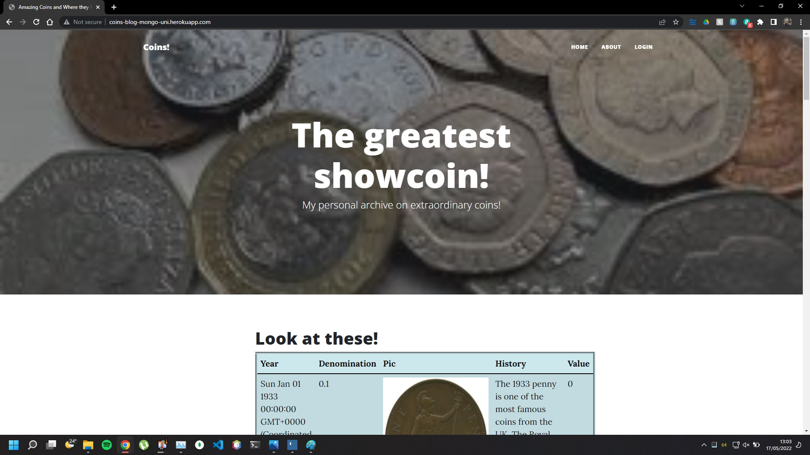
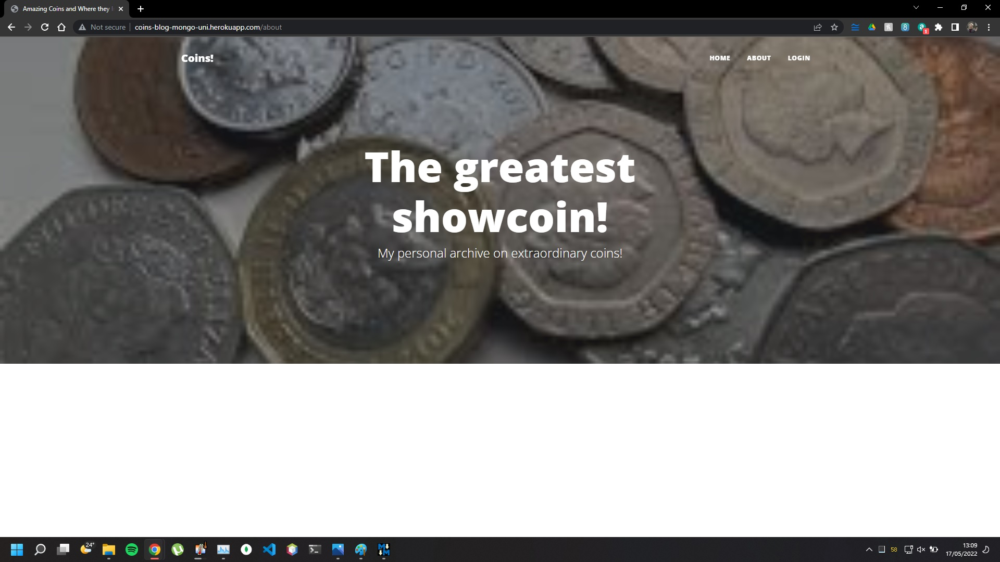
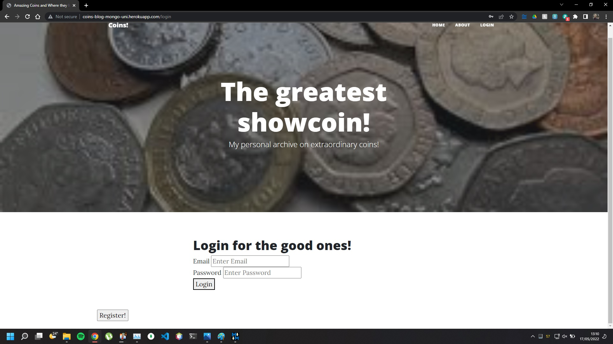
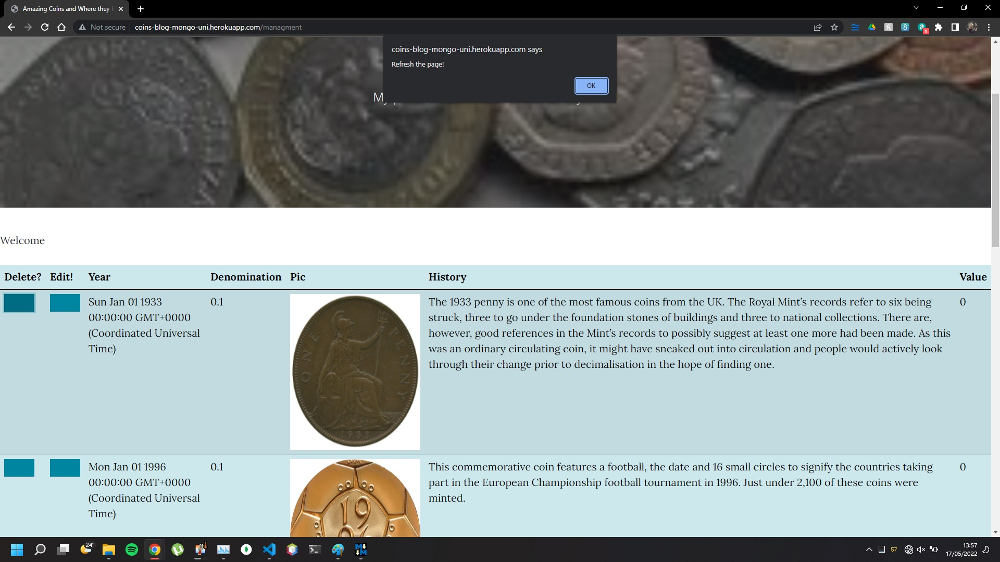
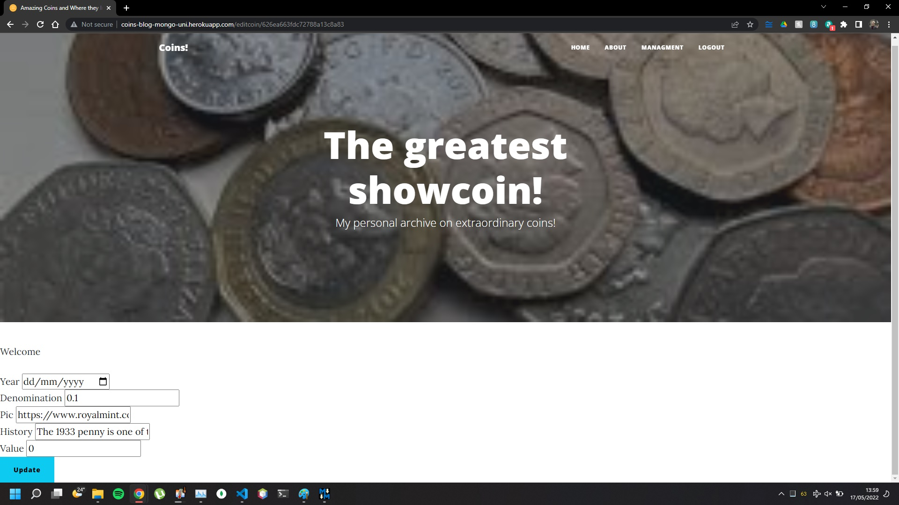
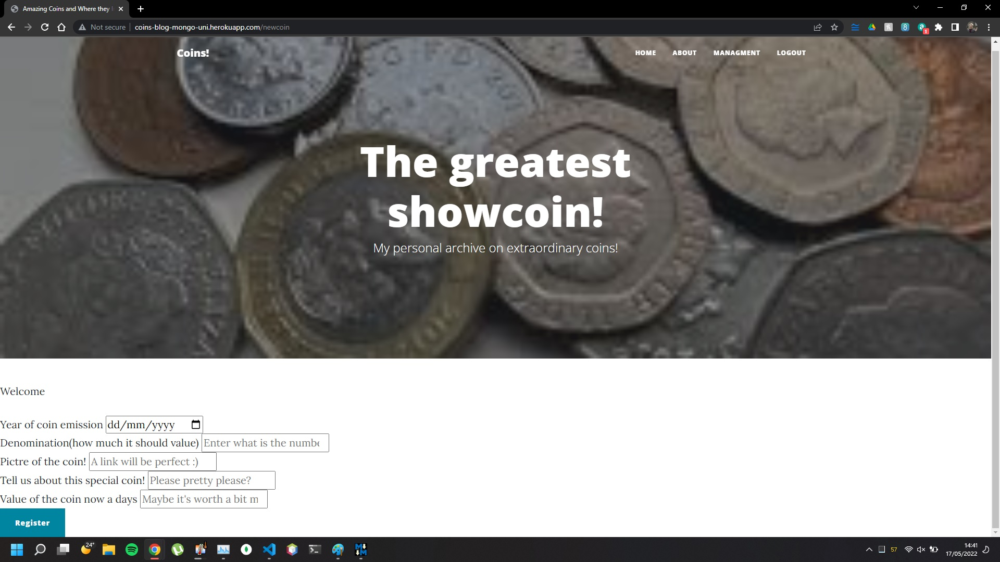

# Rare-Coins-Blog
## Blog create for the class of Advanced Databases class, using [MongoDB](www.mongodb.com/) and [NodeJS](nodejs.org/en/).
For the design of my website I used a minimal [bootstrap](getbootstrap.com/) and a template from the internet.
One of the requirements for this university project was to solve a problem using a non relational database. My choice was to create a blog about old rare coins.
Another one was for the database to be hosted online, which I have chosen to use [Atlas](https://www.mongodb.com/atlas), for the ease of usage.
### I have used the following modules to make my project:
- [bcrypt](www.npmjs.com/package/bcrypt)
- [body-parser](www.npmjs.com/package/body-parser)
- [connect-flash](www.npmjs.com/package/connect-flash)
- [cors](www.npmjs.com/package/cors)
- [dotenv](www.npmjs.com/package/dotenv)
- [ejs](www.npmjs.com/package/ejs)
- [express](www.npmjs.com/package/express)
- [express-session](www.npmjs.com/package/express-session)
- [jsonwebtoken](www.npmjs.com/package/jsonwebtoken)
- [mongoose](www.npmjs.com/package/mongoose)
- [nodemon](www.npmjs.com/package/nodemon)
- [parser](www.npmjs.com/package/parser)
- [passport](www.npmjs.com/package/passport)
- [passport-local](www.npmjs.com/package/passport-local)
- [path](www.npmjs.com/package/path)


For my [home page](coins-blog-mongo-uni.herokuapp.com), I decided to display the database and some buttons on the top part, these buttons are:
- Home
- About
- Login

To display the database I used simple function to find all the coins on the database and load it to the model.

### The index page
* On the index page I used ejs to load and display the [JavaScript](www.javascript.com/) code to feed the page.

### The about page
* The [About page](http://coins-blog-mongo-uni.herokuapp.com/about), is empty and was put there to simulate a real world scenario where the owner of the page would talk about himself and why the page.



### The login page
* The [login page](http://coins-blog-mongo-uni.herokuapp.com/login) was created due to another requirement of the project, there was necessity for security measures, for that, I decided to implement a simple login system, without necessity for roles, this login system functions by comparing items from a table created on the database, said table saves, name, email and an encrypted password. When email and password match with one from the table, access to a management page is granted to the user.
* Also in the login page, there's a register button, that takes the user to the page I will talk about next.



### The register page
* As mentioned before, the [register page](http://coins-blog-mongo-uni.herokuapp.com/register) can be reached from the login screen, here the user can insert their name, email and a password.
* By doing so, a new item will be created in the user table, this will contain name, email and password, in regards to the password, I took two measures to insure security, one is to make as a requirement for the password to have over 6 digits and second is that the password is hashed when saved at the database, so in case a breach of security, the password is not compromised.
```
app.post('/register', (req, res) => {
    const { name, email, password, password2 } = req.body;
    let errors = [];
    console.log(' Name ' + name + ' email :' + email + ' pass:' + password, 'up to here works!');
    if (!name || !email || !password || !password2) {
        errors.push({ msg: "Please fill in all fields" })
    }
    //check if match
    if (password !== password2) {
        console.log('different passwords')
        errors.push({ msg: "passwords dont match" });
    }

    //check if password is more than 6 characters
    if (password.length < 6) {
        console.log('small passworrds')
        errors.push({ msg: 'password at least 6 characters' })
    }
    if (errors.length > 0) {
        console.log('we got here')
        res.render('register', {
            errors: errors,
            name: name,
            email: email,
            password: password,
            password2: password2
        })
    } else {
        //validation passed
        User.findOne({ email: email }).exec((err, user) => {
            console.log(user);
            if (user) {
                errors.push({ msg: 'email already registered' });
                res.render('register', { errors, name, email, password, password2 })
            } else {
                console.log('good')
                const newUser = new User({
                    name: name,
                    email: email,
                    password: password
                });

                //hash password
                bcrypt.genSalt(10, (err, salt) =>
                    bcrypt.hash(newUser.password, salt,
                        (err, hash) => {
                            if (err) throw err;
                            //save pass to hash
                            newUser.password = hash;
                            //save user
                            newUser.save()
                                .then((value) => {
                                    console.log(value, 'it worked!')
                                    req.flash('success_msg', 'You have now registered!')
                                    res.redirect('/login');
                                })
                                .catch(value => console.log(value));

                        }));
            }
        })
    }
});
```

* At the bottom of the page there's a link leading the user back to the login page in case he clicked by mistake on the register button.


### The management page
Once registered and logged in, the user will have access to a [management page](http://coins-blog-mongo-uni.herokuapp.com/managment). 
* This page is not accessible without login, this is made sure by creating a session on the browser. If the session is not valid, the user will be denied access.

```
loggedIn: function (req, res, next) {
if (req.session.passport.user) {
next();
} else {
res.redirect('/login');
}
```

* For some reason, my code isn't functioning properly, I'm able to identify that there's no session, but the user is not being redirected to the login page as expected. Due to time constrains I won't be able to solve this.
* Once fully logged in, the user will have access to a table similar to the one in the index page, with two major differences, the addition of the delete and edit buttons. Those are self explanatory, one will delete the item from the table and the other one will direct the user to a page where he will be able to edit the entry.
* On the top part of this page, there's also changes, I've dropped the login button, in exchange for a new coin button and a logout button.

### The delete button
* The delete button, doesn't lead to a specific page, it will use the id of the item, which by default is hidden from users, and it will send a delete command to the page.

```
app.delete("/coins/:id", loggedIn, async (request, response) => {
try {
const coins = await coinsModel.findByIdAndDelete(request.params.id);
    if (!coins) response.status(404).send(No item found);
    response.status(200).send();
} catch (error) {
    response.status(500).send(error);
}
});
```
* The only feedback the user will get is a popup message from the browser asking him to refresh the page

```
<script>
  function deletecoin(id) {
    alert("Refresh the page!");
    console.log(id)
    fetch('coins/' + id, {
      method: 'DELETE',
    })
      .then(res => res.text())
      .then(res => console.log(res))
  };

</script>

```


### The edit button

* Clicking the edit button will take the user to a page that will load the values of the coin and display them for editing.
```
app.get('/editcoin/(:id)', loggedIn, function (req, res, next) {

    coinsModel.findById(req.params.id, (err, doc) => {
        if (!err) {
            res.render("editcoin", {
                title: "Update A coin!",
                data: doc
            });
        } else {
            req.flash('error', 'Coin not found with id = ' + req.params.id)
            res.redirect('/managment')
        }
    });
})
```

* This page cannot be accessed without the id of the item to be edited.



### The new coin page.

* This page was created with the intention of allow the user to insert new items on the coin table and have them displayed to the general public.
* Here the user will insert the items I believe are important for this project.
* The items year and denomination are the minimum requirements.
* Pictures, the history and the value of the coin are not requirements.
* This page works by sending a form to a function that upserts it to the model and save it.

##### Html code:

```
<form action="/coins" method="POST">
    <div>
        <label for="Year">Year of coin emission</label>
        <input type="date" name="Year" placeholder="Enter the year when the coin was coined!"/>

    </div>
    <div>
        <label for="Denomination">Denomination(how much it should value)</label>
        <input step="0.1" type="number" name="Denomination" placeholder="Enter what is the number on the coin"/>
    </div>
    <div>
        <label for="Pic">Pictre of the coin!</label>
        <input type="string" name="Pic" placeholder="A link will be perfect :)"/>
    </div>
    <div>
        <label for="History">Tell us about this special coin!</label>
        <input type="string" name="History" placeholder="Please pretty please?"/>
    </div>
    <div>
        <label for="Value">Value of the coin now a days</label>
        <input type="number" name="Value" placeholder="Maybe it's worth a bit more ?"/>

    </div>
    <button onClick="window.location.href=window.location.href" type="submit" class="btn btn-primary btn-block" >
        Register
    </button>
    
    
  ```
    
#####    JavaScript code:
```

app.post('/coins', loggedIn, (req, res) => {
    const { Year, Denomination, Pic, History, Value } = req.body;
    console.log(' Year: ' + Year +
        ' Denomination :' + Denomination +
        ' Pic:' + Pic +
        'History' + History +
        'Value' + Value);
    const newCoin = new coinsModel({
        Year: Year,
        Denominaiton: Denomination,
        Pic: Pic,
        History: History,
        Value: Value
    });
    newCoin.save()
        .then((value) => {
            req.flash('New coin saved!')
            res.redirect('/newcoin');
        })
});
```




### The logout page.
* the logout page itself does not exist, the link only calls a function that destroys the session and redirect the user to the login page again.
```
app.get('/logout', async (req, res) => {
    try {
        req.logout;
        req.flash('success_msg', 'Now logged out');
        console.log('it worked')
        res.redirect('/login');
    } catch (err) {
        console.error(err);
    }

})
```
### The database
* For this project, I used mongoDB hosted on the Atlas platform, for easy of use.
* The user should insert it's own credentials to the Atlas platformm this can be done in the ``.env`` file.
* The mongoose module was used because it has a vast amount of documentation and tutorials on the internet, which allowed me to more easily to develop my project.
#### The coin Document :
* The coin document is the one holding the information for the website.
* The model is created automatically by the server once it's running.
``` 
const CoinsSchema = new mongoose.Schema({
    Year: {
        type: Date,
        default: 0,
        required: true,
        validate(value) {
            if (value < 0) throw new Error("Coins were mande at a point in time!");
        },
    },
    Denomination: {
        type: Number,
        default: 0.1,
        required: true,
        validate(value) {
            if (value < 0) throw new Error("Coins always should have a denomination");
        },
    },
    Pic: {
        type: String,
        required: false,
        trim: false,
        lowercase: false,
    },
    History: {
        type: String,
        required: false,
        trim: false,
        lowercase: false,
    },
    Value: {
        type: Number,
        default: 0,
        required: false,
    },
});

```
* It can be seen in the code as mentioned before that Date and Year are requirements for the model.

#### The User Document : 
* On this document all the information about the registered user is being held.
```
const User = mongoose.model(
    "User",
    new mongoose.Schema({
        name:String,
        email: String,
        password: String,
        roles: [
            {
                type: mongoose.Schema.Types.ObjectId,
                ref: "Role"
            }
        ]
    })
);
```
* On this one, I've decided to make the security and requirements while creating the new user instead of doing it while creating the document, this leads us to a very simple model.

### Initialization
* If being run locally, the user should insert the port which he intend to use on the **``.env``** file.
* The project should work automatically once the command ```npm install``` and ```npm start``` are given, all the modules should be installed automatically and ready to go.
* In the scenario of it not running, all the package used are in this ready and on the **package.json**


